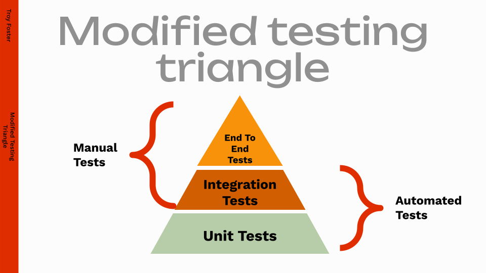
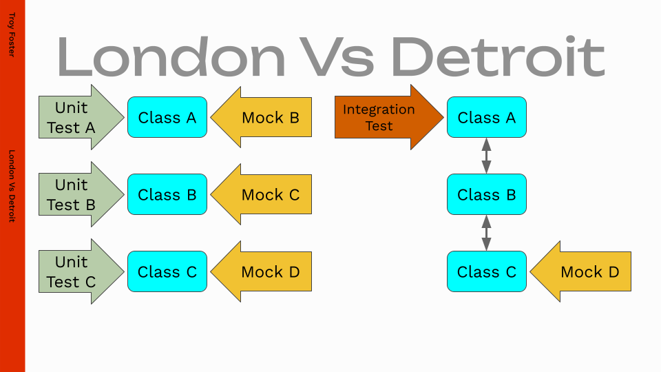

Starting Testing:

Last year, at a software conference session Q&A, someone else asked a really good question.

"How do you start testing when you have none?"

[Video link](https://mediaspace.esri.com/media/t/1_274g6nh3/325483122)

Jump to about 59 minutes in that video to hear when it is asked and for the response.

I was in the audience there and I really liked this question.  I have dealt with this situation before.  Working in a legacy code base with only manual testing, then adding the first few automated unit and integration tests.  Then eventually changing the culture of the organization to be more test first.

Getting the first few tests can be quite difficult. 

The test triangle:

Part of talking about automated testing is making sure that everyone is on the same page.  Ideally with automated tests you should have a bunch of unit tests, each testing individual functions and all their edge cases.  Integration tests making sure that different functions and classes work together in an expected way, and End to End tests working your software the way end users do.

London Vs Detroit schools of testing:

With unit and integration tests, there are a few different schools of thought.  Should a test case target a single function or can one test case exercise multiple pieces of code?  The answer to that question is "it depends", it depends on the code you are trying to test, what that code does, how interconnected it is, what programmign language you are using and probably a dozen other things.

Here are my steps for success:

1. Figure out what is preventing testing.
    * Social
        * Management feature crush preventing taking time to add more tests
        * Schedule crush
        * Developer experience level
    * Code
        * Complexity
        * Legacy
        * Untestable patterns
        * Existing issues
    * Test Infrastructure
        * Makefiles
        * Run scripts
        * Unit test main function
    * Tests
        * Test framework complexity
        * Lack of experience with writing testing code
        * The Unique syntax frameworks use
            * What even is `EXPECT_EQ`?
2. Choose a unit testing framework
    * Unit testing frameworks make testing easier.
        * They provide the glue so you can write tests 
    * Ask the other developers what ones they have used before
    * Find a survey where developers tell what framework they use
        * [Jetbrains Developer Ecosystem 2023 is excellent for this](https://www.jetbrains.com/lp/devecosystem-2023/)
        * [c++ section](https://www.jetbrains.com/lp/devecosystem-2023/cpp/#cpp_unittesting_two_years)
    * Do not home make your own testing framework.  If you were not able to get testing started before, what makes you think you can maintain a custom testing framework?
    * Just pick a framework.  My recommendation is to pick the most popular one for your programming language.
3. Start with a simple unit test
    * Test a simple function or class
        * Setters and Getters
        * Or a simple function with well defined inputs and outputs
    * Follow simple Assemble, Act, Assert
    * Find a guide for your testing framework
        * Coworker, course, blog, Youtube/conference talk?
    * These tests should be effectively trivial, if you were to write them in a few months once you have a bunch of tests they would be done really quickly.
    * The whole point of the first tests being simple is to have them not be a blocker for wiring of the test infrastructure.
4. Wire up test infrastructure
    * Makefiles
    * Unit test main function
    * Run scripts
    * Code coverage
    * et cetera
    * Share initial tests with your coworkers
5. Test the most difficult code you have
    * This code is likely tightly coupled with other code in your project
    * Draw out what the code does on a whiteboard
    * Identify seams/interfaces where you call that code and isolate it
    * Use dependency injection to insert mock objects for dependencies
    * Share these tests with your coworkers
    * If you fail, test something of moderate difficulty and try again
6. Address the social issues
    * Management time pressure / Customer Schedule / New feature
        * Coding without tests introduces risks
        * Testing will prevent regressions with the existing code
    * Developers that do not know better
        * Fresh from college or converts from other industries or engineering backgrounds that do not know how to write automated tests
        * Help show them how to test their code
    * Developers that should know better
        * Have been developing since before surge in testing popularity
        * Test the code once when they write it and the tests do not persist in the code
        * Write code too tricky to be tested
        * Show these developers the worth of testing, force them to test their code.
        * Some developers may need a direct order to write tests
7. Enable testing everywhere
    * Add first simple test cases for every class
        * This way developers cant use the lazy excuse "There were not any test cases for me to copy/paste from"
    * Peer program with coworkers to add tests for their issues
    * Cherry pick new hires first issues to be testable
        * These issues do not need to be adding new functionality, they can be written for the purpose of increasing code coverage.

* Testing side benefits and options
    * Accurate SLOC/Coverage
        * initial numbers may not be good but the rate of improvement is great
    * Feedback from customers/manual testing to automated testing
    * Test Driven Development (TDD)
        * You can't do TDD if you don't even have tests.  I want my people to have this option.
    * Bisect when a problem was introduced
    * Performance Profiling
        * Find the slow points by tests
    * Dynamic Analysis
        * Code sanitizers
            * Undefined behavior
            * Address violations
            * Memory leaks
            * Thread safety
            * Write the tests first, prove their usefulness, then enable sanitizers and be terrified that your code does some jank stuff.  There are probably some testisms with uninitialized variables that need to be set.
        * Valgrind
            * Find memory leaks
    * Fuzz testing
        * Unit and integration testing are a useful first step for starting with fuzz testing.  
        * You can recreate fuzz testing findings in a unit test to have them persist
    * Mutation testing
        * Invert an if statement and see if your test cases fail, some tools can do this in an automated fashion.
* Lessons learned
    * Set up Continuous integration / Continuous Deployment
    * If you make changes to test case infrastructure, change a test cases to intentionally fail and verify that the build still fails
        * Common example is once you have enough tests that an early failure scrolls off your terminal, so you add a pipe to tee command so that the logs get saved off, but the pipe quietly ignores the return value from the tests failing.  So the failure does not propagate properly.  Then later on a real failure starts occurring and you do not know about it.
        * If you already have tests and are reading this for pure curiousity, go invert a test assertion so the test case fails, then see if the failure propagates properly to stop the build.
    * Isolate test cases properly
        * Write scripts to run each test case individually
        * Write scripts to find test case interdependencies
            * Find a test shuffle seed which induces failures reliably, then bisect to find which other cases induce the failure
    * Have contractors deliver their test cases with their code
    * Brag about testing improvements
        * Tell me what I am doing wrong
        * Why do you think I am writing this.  I am proud of what my people have done.  We have achieved a massive organizational change from the bottom up.
* Situations encountered:
    * You chose the wrong testing framework
        * Those tests are still valid
        * Converting frameworks is often a change in syntax
    * You broke something external
        * Either down the hall or something really external
        * Simplify a test case and give it to them
        * They can add it to their test collection and know when your issue is fixed
    * Managers inspired to have developers begin testing
        * Give developers permission and guidance
        * May need to break code and practices to get testing to persist
* Can manual testing go away?
    * Probably not
    * Defense in depth is needed
    * Sometimes a human eye is needed
    * Automated tests help prevent regressions and wasting the manual testers time.
* Tests are best started from a point of hate
    * I hate these regressions
    * I hate how long of a process it takes to manually test some behavior
    * I hate that I may need to schedule special hardware time to verify a problem is fixed
    * I hate that the manual testers had a crash occur randomly and the situation may not happen unless the stars and planets align
    * I hate that I may not be able to confidently tell if an issue is actually fixed or not